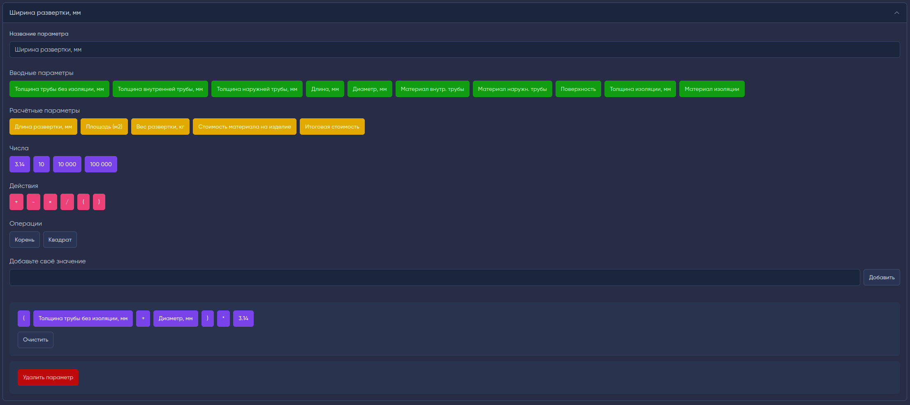

# Materials Сalculator
Основной фичей проекта является кастомный компонент для админ-панели Moonshine, с помощью которого можно:
- Строить простые числовые формулы
- Строить формулы на основе вводимых перед вычислением данных
- Строить формулы используя "соседние", "только что вычисленные" параметры расчёта

Проект писался с целью интеграции в Bitrix24 как локальное приложение, но без каких-либо проблем может использоваться независимо, в качестве сайта.

## Установка
В проекте настроен Docker
1. Проверить в docker-compose.yml доступность локальных портов которые будут занимать сервисы
2. Создать .env на основе .env.example, по необходимости поменять требуемые значения(можно ничего не менять по умолчанию)
3. `docker compose run --rm node install`
4. `docker compose up -d`
5. `docker compose exec php sh` - войти в php контейнер
6. `php artisan key:generate`
7. `exit` - выйти из php контейнера

## Интеграция с Bitrix24
Проверить в .env, что установлен правильный `APP_URL`

1. Перейти на вкладку создания локального приложения
2. В путь обработчика добавить https://example.com
3. В путь первоначальной установки добавить https://example.com/bitrix-install
4. Выдать разрешения на CRM и placement
5. Сохранить приложение, получить `client_id` и `client_secret`
6. В .env заполнить `C_REST_CLIENT_ID`, `C_REST_CLIENT_SECRET`
7. Переустановить приложение
8. Готово, проверить наличие вкладки "Калькулятор" в сделке
